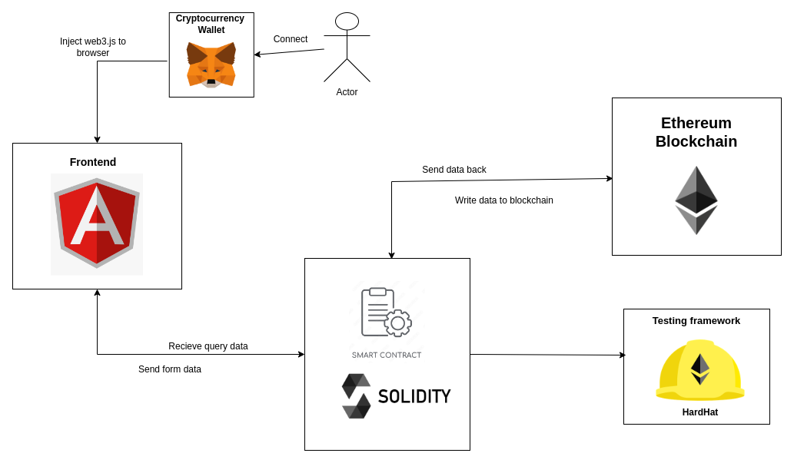

# Project Architecture

## Overview

This document provides an overview of the architecture of our blockchain project. The project consists of a frontend built with Angular, and smart contracts written in Solidity and managed with Hardhat.

## Architecture Diagram



## Components

### 1. Frontend (Angular)

#### Overview
The frontend of the application is developed using Angular, a popular framework for building dynamic web applications. It interacts with the smart contracts deployed on the blockchain network.

#### Key Features
- **User Interface**: Provides a user-friendly interface for interacting with the blockchain.
- **Data Binding**: Utilizes Angular's data binding to reflect real-time changes from the blockchain.
- **Services**: Angular services are used to interact with the blockchain via Web3.js or Ethers.js.

#### Directory Structure
```
/src
  /app
    /components
    /services
  /assets
  /common
  /environments
```

#### Tools and Libraries
- **Angular CLI**: For scaffolding and managing the Angular project.
- **RxJS**: For handling asynchronous operations.
- **Web3.js / Ethers.js**: To interact with the Ethereum blockchain.

### 2. Smart Contracts (Solidity)

#### Overview
The smart contracts are written in Solidity, a statically-typed programming language designed for developing smart contracts that run on the Ethereum Virtual Machine (EVM).

#### Key Features
- **Contract Logic**: Implements the core business logic.
- **Storage**: Manages the storage of data on the blockchain.
- **Events**: Emits events to notify external applications of state changes.

#### Directory Structure
```
/contracts
  MyContract.sol
```

### 3. Development and Deployment (Hardhat)

#### Overview
Hardhat is a development environment for Ethereum that facilitates compiling, deploying, testing, and debugging Ethereum software.

#### Key Features
- **Compilation**: Compiles Solidity contracts.
- **Deployment**: Scripts to deploy contracts to various networks.
- **Testing**: Framework for writing and running tests.
- **Debugging**: Tools for debugging Solidity code.

#### Directory Structure
```
/hardhat.config.js
/ignition
  /modules
    MyModule.js
```

#### Tools and Libraries
- **Hardhat**: Main development environment.
- **Mocha & Chai**: For writing and executing tests.
- **Hardhat Network**: Local Ethereum network for testing.

## Workflow

### Development
1. **Frontend Development**: Angular components, services, and models are developed to create the user interface.
2. **Smart Contract Development**: Solidity contracts are written and tested using Hardhat.
3. **Integration**: The frontend is integrated with the smart contracts using Web3.js or Ethers.js.

### Deployment
1. **Compile Contracts**: Compile Solidity contracts using Hardhat.
2. **Deploy Contracts**: Deploy the compiled contracts to the Ethereum network.
3. **Configure Frontend**: Update the frontend with the deployed contract addresses and ABI.

### Testing
- **Unit Testing**: Solidity contracts are tested using Hardhat's testing framework.
- **Integration Testing**: The interaction between the frontend and the smart contracts is tested to ensure seamless communication.