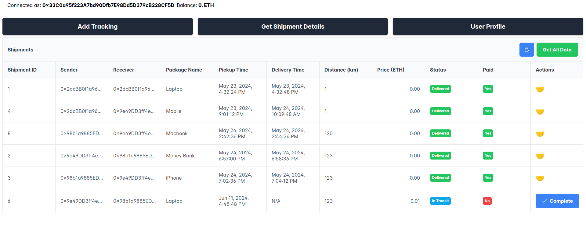

# Development Setup

This document outlines the steps required to set up this project for development. By following these steps, you'll be able to run your application locally with the necessary environment variables and database configuration.

## Prerequisites

Before setting up for development, ensure you have the following prerequisites with the specified versions:

- **NVM (Node Version Manager):** Use NVM to manage Node.js versions.
- **Node.js** Node.js v20.x or higher. Can be installed via `nvm` using `nvm install 20` and used with `nvm use 20`.
- **Git:** Git v2.x or higher.
- **MetaMask:** Chrome Extension to interact with web3 application.

These prerequisites are essential for deploying and running the application in an environment.

Please make sure to have these versions installed on your development server before proceeding with the setup.

## Getting Started

1. Clone the repository to your local machine:

   ```sh
   git clone https://github.com/OsmosysSoftware/supply-chain-blockchain
   ```

2. Install project dependencies:

   ```sh
   npm install
   ```

3. Start Hardhat node

   ```sh
   npx hardhat node
   ```

4. Import Account into metamask

   - When you run the command mentioned in step 3 you will get list of 20 account with private key
   - Import 2-3 account using the private key of that account
   - Check this for reference : [Import Account](https://support.metamask.io/hc/en-us/articles/360015489331-How-to-import-an-account)
   - Make sure you Import Account #0 as by default when you deploy any contract it is used

5. Deploy the contract into localhost

   ```sh
   npx hardhat ignition deploy ./ignition/modules/Tracking.js --network localhost
   ```

   make sure the hardhat node is running when you run this command

   - For more details refer [this](https://github.com/OsmosysSoftware/supply-chain-management/blob/main/docs/contract-deployment.md)

6. Start the application

   ```sh
   ng serve
   ```

   keep the hardhat node running in a separate terminal

   Application will now be running locally at `http://localhost:4200/`.

7. Add localhost network in metamask and switch to it

8. Connect to Metamask wallet using your account

9.  Now you can interact with the application

    

## Docker Setup

To run the application using a Docker container, follow these steps. Assuming the smart contract is already deployed on a public blockchain testnet (in this case, Sepolia testnet):

### 1. Update Environment Variables

Update the environment variables by referring to the `env.example` file. Ensure `environment.ts` is configured correctly for the application to interact with the deployed smart contract.

### 2. Run Docker Compose

Execute the following command to start the application using Docker Compose:

```sh
docker-compose -f docker-compose.yml up
```

### 3. Access the Application

Once the Docker containers are up and running, you can access the application at: [http://localhost:4200/](http://localhost:4200/)

Now, the application should be ready for use within the Docker environment.